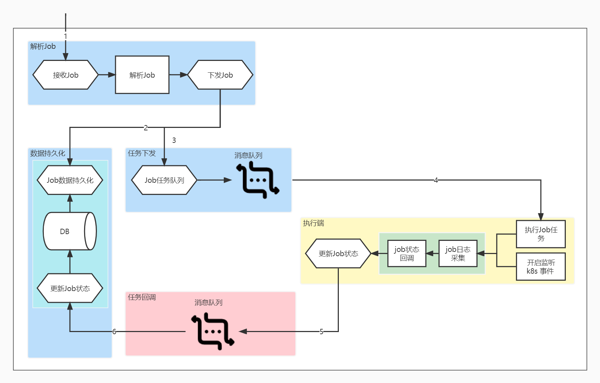

# Kubernetes Job Scheduler
  * Job可用于构建复杂流程业务, 如:数据迁移、数据备份、数据采集等较复杂流程业务 .
  * 本项目可对接多个Kubernetes集群均衡分发Job及cronJob, 回调任务状态、采集运行容器运行日志 .
  
## Require
 * Go 1.17+

## Features
 * 支持k8s Job及Cron Job创建、更新、删除 .
 * 支持多个集群均衡分发Job .
 * 支持Pod容器日志采集、存储 .
 * 提供helm 一键部署脚本 .

## Documentation
* <a href="./doc/api.markdown" alt="链接">接口文档</a>
* <a href="./doc/api.markdown" alt="链接">部署脚本(docs目录下)</a>

## Architecture

## configure
```text
config.properties
[service/服务端配置]
env = dev
pprof_port = :7425                      # pprof/metrics端口 默认: 7424
api_port = :65532                       # api端口 默认: 65532
dsn = root:1234567@tcp(127.0.0.1:3306)/job_scheduling?charset=utf8&parseTime=True&loc=%s&readTimeout=10s&timeout=30s  # mysql
mq_addrs = 127.0.0.1:4161               # nsqlookup 地址
job_push_topic = job_push_topic         # 任务topic 默认: work_job_topic
job_status_topic = job_status_topic     # 状态消息topic 默认: status_job_topic
job_operate_topic = job_operate_topic   # api 超时时间, 默认: 60s
api_timeout_second = 60s                # 更新删除操作最大时间: 15s
lease_lock_namespace = job              # 服务端选举命名空间

[client/客户端配置]
pprof_port = :7425                     # pprof/metrics端口 默认: 7424
mq_addrs = 127.0.0.1:4161              # nsqlookup 地址
job_push_topic = job_push_topic        # 任务topic 默认: work_job_topic
job_status_topic = job_status_topic    # 状态消息topic 默认: status_job_topic
job_operate_topic = job_operate_topic  # api 超时时间, 默认: 60s
client.id = client_id                  # 客户端ID, 每个集群唯一
client.lease_lock_namespace = jobs     # 客户端选举使用的命名空间
client.operate_max_timeout = 20s       # 操作超时时间 删除、更新
```

## 注意事项
* 服务端启动后会进行leader选举, 当执行更新删除等操作Follower会把请求转发给leader, 由leader操作, 回调消息也由leader处理.
* 客户端启动后也会进行leader选举, 只有leader才会监听k8s事件, 因此部署时需注意选举信息的配置.

## LOGS
```text
【服务端启动日志】
2022/05/09 01:06:58 job_schedule_server.go:61: [INFO] server starting
2022/05/09 01:06:58 job_schedule_server.go:62: [INFO] version info: {Version:v0.0.1-bate.1 Product:k8s-job-schedule Website:https://github.com/hhzhhzhhz/k8s-job-scheduler License:Copyright test.}
2022/05/09 01:06:58 job_schedule_server.go:79: [INFO] server started
2022/05/09 01:06:58 job_schedule_server.go:67: [INFO] pprof/metrics service start addr=:7424
2022/05/09 01:06:58 job_schedule_server.go:73: [INFO] http api service start addr=:65532
I0509 01:06:58.724881   22040 leaderelection.go:248] attempting to acquire leader lease job/job...
I0509 01:06:58.832248   22040 leaderelection.go:258] successfully acquired lease job/job
2022/05/09 01:06:58 election.go:117: [INFO] Election.OnNewLeader isleader=true leader=ip:65532 current=ip:65532 
2022/05/09 01:06:58 election.go:101: [INFO] Election.OnStartedLeading identity=ip:65532
2022/05/09 01:06:58 recipienter.go:59: [INFO] Subscribe Mq topic=status_job_topic
【服务端执行日志】

【客户端启动日志】
2022/05/09 01:06:48 job_executor.go:33: [INFO] pprof/metrics service start addr: :7424
2022/05/09 01:06:48 job_executor.go:57: [INFO] server starting
2022/05/09 01:06:48 job_executor.go:58: [INFO] version info: {Version:v0.0.1-bate.1 Product:k8s-job-schedule Website:https://github.com/hhzhhzhhz/k8s-job-scheduler License:Copyright test.}
2022/05/09 01:06:49 job_executor.go:63: [INFO] server started
I0509 01:06:49.100347    2080 leaderelection.go:248] attempting to acquire leader lease jobs/job...
2022/05/09 01:06:49 election.go:117: [INFO] Election.OnNewLeader isleader=false leader=1626a3da-0997-44f6-80be-0f30b08896fb current=051c2a6a-9938-4fc7-bb82-2f4205603e5f 
2022/05/09 01:07:08 election.go:117: [INFO] Election.OnNewLeader isleader=true leader=051c2a6a-9938-4fc7-bb82-2f4205603e5f current=051c2a6a-9938-4fc7-bb82-2f4205603e5f 
2022/05/09 01:07:08 election.go:101: [INFO] Election.OnStartedLeading identity=051c2a6a-9938-4fc7-bb82-2f4205603e5f
2022/05/09 01:07:08 execlient.go:70: [INFO] Subscribe k8s events namespace=All
I0509 01:07:08.510954    2080 leaderelection.go:258] successfully acquired lease jobs/job
【客户端执行日志】
2022/05/14 14:23:31 election.go:101: [INFO] Election.OnStartedLeading identity=44241b15-9b7c-452e-92ba-2e441a8cbf46
2022/05/14 14:23:31 execlient.go:196: [INFO] jobEvent 2022/05/14 14:21:00 state=0 skip=false action=OnceAdd namespace=default job_type=cron job_id=4a04f098-272b-437d-bbd6-6bb8d78f1a3d message=type=Complete stauts=True cause=,
2022/05/14 14:23:31 execlient.go:196: [INFO] jobEvent 2022/05/14 14:20:00 state=0 skip=false action=OnceAdd namespace=default job_type=cron job_id=4a04f098-272b-437d-bbd6-6bb8d78f1a3d message=type=Complete stauts=True cause=,
2022/05/14 14:23:31 execlient.go:196: [INFO] jobEvent 2022/05/14 14:22:00 state=0 skip=false action=OnceAdd namespace=default job_type=cron job_id=4a04f098-272b-437d-bbd6-6bb8d78f1a3d message=type=Complete stauts=True cause=,
2022/05/14 14:23:31 execlient.go:110: [INFO] PodEvent 2022/05/14 14:21:00 action=PodAdd namespace=default job_name=cron-test-echo pod_name=cron-test-echo-27537501-wj429 job_type=cron job_id=4a04f098-272b-437d-bbd6-6bb8d78f1a3d message=Succeeded
2022/05/14 14:23:31 execlient.go:110: [INFO] PodEvent 2022/05/14 14:20:00 action=PodAdd namespace=default job_name=cron-test-echo pod_name=cron-test-echo-27537500-zsj9w job_type=cron job_id=4a04f098-272b-437d-bbd6-6bb8d78f1a3d message=Succeeded
2022/05/14 14:23:31 collect.go:140: [INFO] Collect.RunLog collection run log pod_name=cron-test-echo-27537501-wj429 namespace=default
2022/05/14 14:23:31 execlient.go:110: [INFO] PodEvent 2022/05/14 14:22:03 action=PodAdd namespace=default job_name=cron-test-echo pod_name=cron-test-echo-27537502-k45h9 job_type=cron job_id=4a04f098-272b-437d-bbd6-6bb8d78f1a3d message=Succeeded
2022/05/14 14:23:31 execlient.go:110: [INFO] PodEvent 2022/05/14 14:22:51 action=PodAdd namespace=default job_name=job-6 pod_name=job-6-l4hgt job_type=once job_id=58d6657a-0f4c-4442-8c50-cc7ff85769c6 message=Pending
2022/05/14 14:23:31 collect.go:140: [INFO] Collect.RunLog collection run log pod_name=cron-test-echo-27537500-zsj9w namespace=default
2022/05/14 14:23:31 execlient.go:110: [INFO] PodEvent 2022/05/14 14:20:03 action=PodAdd namespace=default job_name=cron-test-echo pod_name=cron-test-echo-27537500-b4jns job_type=cron job_id=4a04f098-272b-437d-bbd6-6bb8d78f1a3d message=Succeeded
2022/05/14 14:23:31 execlient.go:110: [INFO] PodEvent 2022/05/14 14:21:02 action=PodAdd namespace=default job_name=cron-test-echo pod_name=cron-test-echo-27537501-668q9 job_type=cron job_id=4a04f098-272b-437d-bbd6-6bb8d78f1a3d message=Succeeded
2022/05/14 14:23:31 collect.go:140: [INFO] Collect.RunLog collection run log pod_name=cron-test-echo-27537502-k45h9 namespace=default
2022/05/14 14:23:31 collect.go:140: [INFO] Collect.RunLog collection run log pod_name=cron-test-echo-27537501-668q9 namespace=default
2022/05/14 14:23:31 collect.go:140: [INFO] Collect.RunLog collection run log pod_name=cron-test-echo-27537500-b4jns namespace=default
2022/05/14 14:23:31 execlient.go:110: [INFO] PodEvent 2022/05/14 14:22:00 action=PodAdd namespace=default job_name=cron-test-echo pod_name=cron-test-echo-27537502-k4g9z job_type=cron job_id=4a04f098-272b-437d-bbd6-6bb8d78f1a3d message=Succeeded
2022/05/14 14:23:31 collect.go:140: [INFO] Collect.RunLog collection run log pod_name=cron-test-echo-27537502-k4g9z namespace=default
2022/05/14 14:23:31 execlient.go:196: [INFO] jobEvent 2022/05/14 14:22:51 state=0 skip=true action=OnceAdd namespace=default job_type=once job_id=58d6657a-0f4c-4442-8c50-cc7ff85769c6 message=
2022/05/14 14:23:32 collect.go:127: [INFO] Collect.RunLog log collection completed pod_name=cron-test-echo-27537500-b4jns namespace=default
2022/05/14 14:23:32 collect.go:127: [INFO] Collect.RunLog log collection completed pod_name=cron-test-echo-27537502-k45h9 namespace=default
2022/05/14 14:23:32 collect.go:127: [INFO] Collect.RunLog log collection completed pod_name=cron-test-echo-27537500-zsj9w namespace=default
2022/05/14 14:23:32 collect.go:127: [INFO] Collect.RunLog log collection completed pod_name=cron-test-echo-27537501-668q9 namespace=default
2022/05/14 14:23:32 collect.go:127: [INFO] Collect.RunLog log collection completed pod_name=cron-test-echo-27537502-k4g9z namespace=default
2022/05/14 14:23:32 collect.go:127: [INFO] Collect.RunLog log collection completed pod_name=cron-test-echo-27537501-wj429 namespace=default
2022/05/14 14:23:33 execlient.go:196: [INFO] jobEvent 2022/05/14 14:23:00 state=0 skip=false action=OnceAdd namespace=default job_type=cron job_id=4a04f098-272b-437d-bbd6-6bb8d78f1a3d message=
2022/05/14 14:23:33 execlient.go:110: [INFO] PodEvent 2022/05/14 14:23:00 action=PodAdd namespace=default job_name=cron-test-echo pod_name=cron-test-echo-27537503-sfn9d job_type=cron job_id=4a04f098-272b-437d-bbd6-6bb8d78f1a3d message=Pending
2022/05/14 14:23:33 execlient.go:110: [INFO] PodEvent 2022/05/14 14:23:00 action=PodUpdate namespace=default job_name=cron-test-echo pod_name=cron-test-echo-27537503-sfn9d job_type=cron job_id=4a04f098-272b-437d-bbd6-6bb8d78f1a3d message=Pending
2022/05/14 14:23:33 execlient.go:196: [INFO] jobEvent 2022/05/14 14:23:00 state=0 skip=true action=OnceUpdate namespace=default job_type=cron job_id=4a04f098-272b-437d-bbd6-6bb8d78f1a3d message=
2022/05/14 14:23:33 execlient.go:110: [INFO] PodEvent 2022/05/14 14:23:00 action=PodUpdate namespace=default job_name=cron-test-echo pod_name=cron-test-echo-27537503-sfn9d job_type=cron job_id=4a04f098-272b-437d-bbd6-6bb8d78f1a3d message=Pending
2022/05/14 14:23:34 execlient.go:110: [INFO] PodEvent 2022/05/14 14:23:00 action=PodUpdate namespace=default job_name=cron-test-echo pod_name=cron-test-echo-27537503-sfn9d job_type=cron job_id=4a04f098-272b-437d-bbd6-6bb8d78f1a3d message=Pending
2022/05/14 14:23:41 execlient.go:110: [INFO] PodEvent 2022/05/14 14:22:51 action=PodUpdate namespace=default job_name=job-6 pod_name=job-6-l4hgt job_type=once job_id=58d6657a-0f4c-4442-8c50-cc7ff85769c6 message=Succeeded
2022/05/14 14:23:41 collect.go:140: [INFO] Collect.RunLog collection run log pod_name=job-6-l4hgt namespace=default
2022/05/14 14:23:41 execlient.go:196: [INFO] jobEvent 2022/05/14 14:22:51 state=0 skip=true action=OnceUpdate namespace=default job_type=once job_id=58d6657a-0f4c-4442-8c50-cc7ff85769c6 message=
2022/05/14 14:23:41 execlient.go:110: [INFO] PodEvent 2022/05/14 14:22:51 action=PodUpdate namespace=default job_name=job-6 pod_name=job-6-l4hgt job_type=once job_id=58d6657a-0f4c-4442-8c50-cc7ff85769c6 message=Succeeded
2022/05/14 14:23:41 execlient.go:196: [INFO] jobEvent 2022/05/14 14:22:51 state=2 skip=false action=OnceUpdate namespace=default job_type=once job_id=58d6657a-0f4c-4442-8c50-cc7ff85769c6 message=type=Complete stauts=True cause=,
2022/05/14 14:23:41 collect.go:127: [INFO] Collect.RunLog log collection completed pod_name=job-6-l4hgt namespace=default
2022/05/14 14:23:41 execlient.go:110: [INFO] PodEvent 2022/05/14 14:22:51 action=PodUpdate namespace=default job_name=job-6 pod_name=job-6-l4hgt job_type=once job_id=58d6657a-0f4c-4442-8c50-cc7ff85769c6 message=Succeeded
2022/05/14 14:23:42 execlient.go:110: [INFO] PodEvent 2022/05/14 14:23:00 action=PodUpdate namespace=default job_name=cron-test-echo pod_name=cron-test-echo-27537503-sfn9d job_type=cron job_id=4a04f098-272b-437d-bbd6-6bb8d78f1a3d message=Succeeded
2022/05/14 14:23:42 collect.go:140: [INFO] Collect.RunLog collection run log pod_name=cron-test-echo-27537503-sfn9d namespace=default
2022/05/14 14:23:42 execlient.go:110: [INFO] PodEvent 2022/05/14 14:23:09 action=PodAdd namespace=default job_name=cron-test-echo pod_name=cron-test-echo-27537503-d8vmj job_type=cron job_id=4a04f098-272b-437d-bbd6-6bb8d78f1a3d message=Pending
2022/05/14 14:23:42 execlient.go:110: [INFO] PodEvent 2022/05/14 14:23:09 action=PodUpdate namespace=default job_name=cron-test-echo pod_name=cron-test-echo-27537503-d8vmj job_type=cron job_id=4a04f098-272b-437d-bbd6-6bb8d78f1a3d message=Pending
2022/05/14 14:23:42 execlient.go:196: [INFO] jobEvent 2022/05/14 14:23:00 state=0 skip=true action=OnceUpdate namespace=default job_type=cron job_id=4a04f098-272b-437d-bbd6-6bb8d78f1a3d message=
2022/05/14 14:23:42 execlient.go:110: [INFO] PodEvent 2022/05/14 14:23:00 action=PodUpdate namespace=default job_name=cron-test-echo pod_name=cron-test-echo-27537503-sfn9d job_type=cron job_id=4a04f098-272b-437d-bbd6-6bb8d78f1a3d message=Succeeded
2022/05/14 14:23:42 execlient.go:196: [INFO] jobEvent 2022/05/14 14:23:00 state=0 skip=true action=OnceUpdate namespace=default job_type=cron job_id=4a04f098-272b-437d-bbd6-6bb8d78f1a3d message=
2022/05/14 14:23:43 execlient.go:110: [INFO] PodEvent 2022/05/14 14:23:09 action=PodUpdate namespace=default job_name=cron-test-echo pod_name=cron-test-echo-27537503-d8vmj job_type=cron job_id=4a04f098-272b-437d-bbd6-6bb8d78f1a3d message=Pending
2022/05/14 14:23:43 collect.go:127: [INFO] Collect.RunLog log collection completed pod_name=cron-test-echo-27537503-sfn9d namespace=default
2022/05/14 14:23:43 execlient.go:110: [INFO] PodEvent 2022/05/14 14:23:00 action=PodUpdate namespace=default job_name=cron-test-echo pod_name=cron-test-echo-27537503-sfn9d job_type=cron job_id=4a04f098-272b-437d-bbd6-6bb8d78f1a3d message=Succeeded
2022/05/14 14:23:44 execlient.go:110: [INFO] PodEvent 2022/05/14 14:23:09 action=PodUpdate namespace=default job_name=cron-test-echo pod_name=cron-test-echo-27537503-d8vmj job_type=cron job_id=4a04f098-272b-437d-bbd6-6bb8d78f1a3d message=Pending
2022/05/14 14:23:50 execlient.go:255: [ERROR] Excellent.Callback failed url=http://127.0.0.1:9999/xxxxxxx message=&{JobId:58d6657a-0f4c-4442-8c50-cc7ff85769c6 Success:true Message:type=Complete stauts=True cause=,} cause=Post "http://127.0.0.1:9999/xxxxxxx": dial tcp 127.0.0.1:9999: connectex: No connection could be made because the target machine actively refused it.
2022/05/14 14:24:00 execlient.go:110: [INFO] PodEvent 2022/05/14 14:23:09 action=PodUpdate namespace=default job_name=cron-test-echo pod_name=cron-test-echo-27537503-d8vmj job_type=cron job_id=4a04f098-272b-437d-bbd6-6bb8d78f1a3d message=Succeeded
2022/05/14 14:24:00 collect.go:140: [INFO] Collect.RunLog collection run log pod_name=cron-test-echo-27537503-d8vmj namespace=default
```